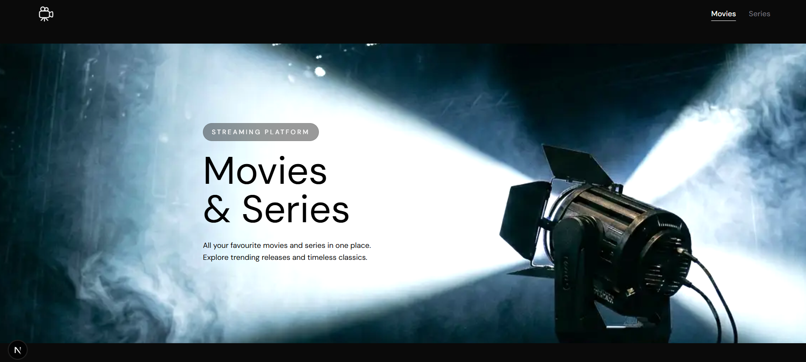
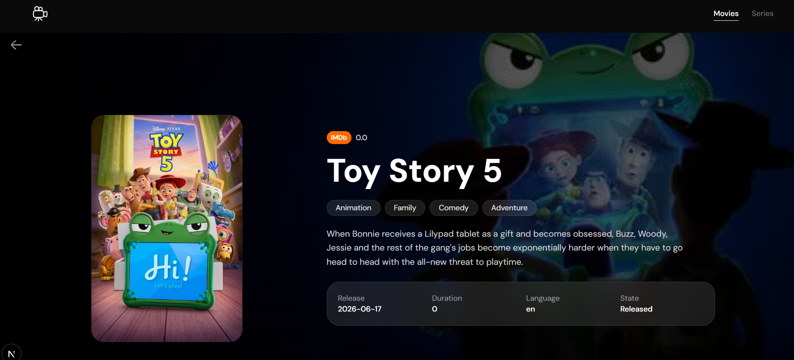

# Movies & Series App

## Descripción

Aplicación web desarrollada con Next.js que permite explorar películas y series utilizando la API de TMDB (The Movie Database).

El proyecto incluye:

* Visualización de películas y series populares
* Cambio dinámico entre modo películas y series
* Página de detalle individual
* Diseño responsive
* Estados de carga y manejo de errores
* Interfaz construida con Tailwind CSS

---

## Tecnologías utilizadas

* Next.js
* React
* Tailwind CSS
* Axios
* TMDB API
* Iconify

---

## Instrucciones de instalación

1. Clonar el repositorio:

```bash
git clone URL_DEL_REPOSITORIO
```

2. Instalar dependencias:

```bash
npm install
```

---

## Instrucciones para ejecutar el proyecto

Ejecutar el servidor de desarrollo:

```bash
npm run dev
```

Abrir en el navegador:

```txt
http://localhost:3000
```

---

## Endpoints utilizados

### Películas en tendencia

```txt
/movie/trending
```

### Películas populares

```txt
/movie/popular
```

### Películas mejor puntuadas

```txt
/movie/top_rated
```

### Películas en cartelera

```txt
/movie/now_playing
```

### Próximos estrenos

```txt
/movie/upcoming
```

### Series populares

```txt
/tv/popular
```

### Series mejor puntuadas

```txt
/tv/top_rated
```

### Detalle de película

```txt
/movie/{id}
```

### Detalle de serie

```txt
/tv/{id}
```

---

## Capturas de pantalla

### Home



### Página de detalle



---

## Declaración de uso de IA

Durante el desarrollo del proyecto se utilizó inteligencia artificial como herramienta de asistencia para:

* Resolución de errores
* Manejo de comunicación entre componentes
* Detalles específicos de estilos
* Explicación de conceptos de React y Next.js

Todo el código fue comprendido, adaptado e integrado manualmente dentro del proyecto.
